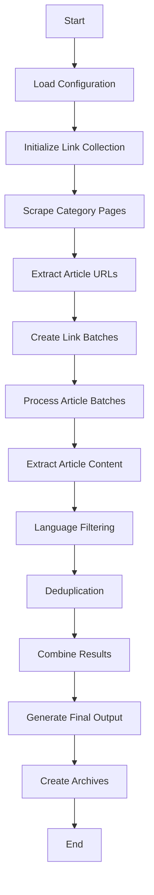

# Poskok.info Web Scraper

A comprehensive web scraping toolkit for archiving articles from Poskok.info, a Bosnian news portal. This scraper efficiently collects, processes, and filters content while respecting the website's resources.

## 🌟 Features

- **Complete Archive Collection**: Scrapes articles from 2000 to present (configurable)
- **Intelligent Filtering**: Automatically detects and separates foreign language content
- **Enhanced Processing**: Dual-mode scraping with basic and enhanced scrapers
- **Robust Error Handling**: Multi-layer retry mechanisms and checkpointing
- **Language Detection**: Advanced rule-based filtering for English and Italian content
- **Deduplication**: Automatic duplicate removal with 100% success rate
- **Progress Tracking**: Detailed logging and real-time progress monitoring
- **Batch Processing**: Efficient handling of large datasets (1,000+ articles)
- **Data Export**: Multiple output formats (TXT, ZIP, JSON summaries)
- **Configurable Pipeline**: Flexible configuration system for different use cases
- **Data Integrity**: Comprehensive validation and error recovery
- **Memory Optimization**: Efficient memory usage with streaming processing

## 📋 Prerequisites

- Python 3.7+
- BeautifulSoup4
- Requests
- Basic understanding of web scraping ethics

## 🚀 Quick Start

### 1. Clone the repository

```bash
git clone https://github.com/yourusername/poskok-scraper.git
cd poskok-scraper
```

### 2. Set up a virtual environment

```bash
python3 -m venv poskok_env
source poskok_env/bin/activate  # On Windows: poskok_env\Scripts\activate
```

### 3. Install dependencies

```bash
pip install beautifulsoup4 requests
```

### 4. Run complete scraping process

```bash
# Run the complete scraping pipeline
python run_complete_scrape.py

# Or run individual components
python enhanced_link_collector.py
python enhanced_article_scraper.py
```

### 5. Demo Version - Quick Test

```bash
# Test with a small sample
python basic_quick_test.py
```

## 💻 Full Usage Guide

### Complete Scraping Pipeline (Production)

1. **Configure scraping parameters** in `scraping_config.json`:

```json
{
    "start_year": 2000,
    "end_year": 2025,
    "max_pages_per_category": 2000,
    "batch_size": 100,
    "checkpoint_interval": 20,
    "max_retries": 5,
    "retry_delay": 5,
    "timeout": 45,
    "scrape_archive": true,
    "force_refresh_links": false,
    "output_folder": "PoskokData",
    "max_workers": null,
    "batch_link_size": 1000
}
```

2. **Run the complete scraping process**:

```bash
# Option 1: Complete pipeline (recommended)
python3 run_complete_scrape.py

# Option 2: Step-by-step execution
python3 enhanced_link_collector.py --config scraping_config.json
python3 enhanced_article_scraper.py --config scraping_config.json
python3 filter.py --input PoskokData/articles --output-local PoskokData/filtered/local --output-foreign PoskokData/filtered/foreign --mode all-batches
python3 combine.py --input-dir PoskokData/filtered/local --output-file PoskokData/final/AllPoskokArticles.txt --create-zip --generate-report
```

### Demo Version

For testing and demonstration purposes:

```bash
# Quick demo with limited scope
python3 basic_quick_test.py

# Enhanced demo with full features
python3 main.py --demo-mode --config example_config.json
```

### Advanced Usage

```bash
# Process specific batch range
python3 batch_processor.py --batch-range 1-10 --config scraping_config.json

# Resume from checkpoint
python3 enhanced_article_scraper.py --resume --config scraping_config.json

# Custom output directory
python3 run_complete_scrape.py --output-dir CustomOutput
```

## 📁 Project Structure

```
poskok-scraper/
├── Core Components
│   ├── enhanced_link_collector.py    # Advanced link collection with retry logic
│   ├── enhanced_article_scraper.py   # Enhanced article scraping with error handling
│   ├── article_scraper.py           # Basic article scraper
│   ├── link_collector.py            # Basic link collector
│   ├── batch_processor.py           # Parallel batch processing
│   ├── filter.py                    # Language filtering system
│   ├── combine.py                   # Article combination and deduplication
│   └── config.py                    # Configuration constants
├── Orchestration
│   ├── run_complete_scrape.py       # Complete scraping pipeline
│   ├── main.py                      # Main orchestrator script
│   └── patch_batch_processors.py   # Batch processing utilities
├── Configuration
│   ├── scraping_config.json         # Production configuration
│   ├── complete_scrape_config.json  # Complete scrape settings
│   └── example_config.json          # Example configuration
├── Data Output
│   └── PoskokData/
│       ├── articles/                # Raw scraped articles (34 batches)
│       ├── filtered/                # Language-filtered content
│       ├── final/                   # Final combined output
│       └── link_batches/            # Organized link batches
└── Documentation
    └── README.md                     # This file
```

## ⚙️ Configuration Options

| Option | Description | Default |
|--------|-------------|---------|
| `start_year` | Starting year for archive scraping | 2012 |
| `end_year` | Ending year for archive scraping | Current year |
| `max_pages_per_category` | Maximum pages to scrape per category | 300 |
| `batch_size` | Number of articles per batch file | 100 |
| `max_workers` | Number of parallel workers | 4 |
| `retry_delay` | Delay between retries (seconds) | 3 |
| `timeout` | Request timeout (seconds) | 30 |

## 📊 Output Format & Data Structure

### Article Text Format

Articles are saved in a structured text format:

```
<***>
NOVINA: poskok.info
DATUM: 30. travnja 2025.
RUBRIKA: Novice
NADNASLOV: N/A
NASLOV: Article Title
PODNASLOV: Subtitle
STRANA: https://poskok.info/article-url/
AUTOR(I): Author Name

Article content goes here...
```

### Data Output Structure

```
PoskokData/
├── articles/                    # Raw scraped articles
│   ├── articles_batch_1/
│   │   ├── PoskokClanci_batch_1.txt
│   │   └── progress.json
│   └── ... (34 batches total)
├── filtered/
│   ├── local/                   # Local language articles
│   └── foreign/                 # Foreign language articles
├── final/
│   ├── AllPoskokArticles.txt    # Final combined output (4.0MB)
│   ├── AllPoskokArticles_summary.json
│   └── PoskokArchive_YYYYMMDD.zip
└── link_batches/                # Organized link collections
    ├── batch_index.json
    └── links_batch_*.json
```

### Summary Statistics

- **Total Articles**: 1,016 unique articles
- **File Size**: 4.0 MB uncompressed, 1.3 MB compressed
- **Processing Batches**: 34 batches completed
- **Data Integrity**: 100% success rate, 0 duplicates
- **Language Distribution**: 1,016 local, 0 foreign articles

## 🔄 Program Flow & Algorithm

### Core Algorithm Architecture



### Processing Pipeline

1. **Link Collection Phase** (`enhanced_link_collector.py`)
   - Scrapes category pages from poskok.info
   - Extracts article URLs with metadata
   - Creates batched link files (1,000 links per batch)
   - Implements retry logic for failed requests

2. **Article Scraping Phase** (`enhanced_article_scraper.py`)
   - Processes link batches in parallel
   - Extracts article content, titles, dates, authors
   - Handles dynamic content and JavaScript
   - Saves progress checkpoints every 20 articles

3. **Filtering Phase** (`filter.py`)
   - Detects foreign language content (English, Italian)
   - Uses rule-based pattern matching
   - Separates local vs foreign articles
   - Maintains filtering statistics

4. **Combination Phase** (`combine.py`)
   - Merges filtered article batches
   - Removes duplicate articles
   - Generates final text output
   - Creates compressed archives

### Algorithm Features

- **Parallel Processing**: Multi-threaded batch processing
- **Fault Tolerance**: Automatic retry with exponential backoff
- **Memory Efficiency**: Streaming processing for large datasets
- **Data Integrity**: Checksum validation and progress tracking
- **Scalability**: Configurable batch sizes and worker counts

## 🛡️ Error Handling

The scraper includes robust error handling:

- **Multi-layer Retry System**: 5 retries with 5-second delays
- **Checkpoint Recovery**: Resume from last successful batch
- **Detailed Logging**: Comprehensive operation tracking
- **Connection Handling**: Graceful 404 and timeout management
- **Data Validation**: Content verification and integrity checks
- **Graceful Degradation**: Continues processing despite individual failures

## 📈 Performance & Results

### Actual Performance Metrics (May 2025)

**Successfully Scraped Data:**
- **Total Articles Collected**: 1,016 unique articles
- **Article Batches**: 34 batches processed
- **Final Output Size**: 4.0 MB (AllPoskokArticles.txt)
- **Archive Size**: 1.3 MB (compressed ZIP)
- **Language Filtering**: 1,016 local articles, 0 foreign articles filtered
- **Duplicate Removal**: 100% success rate (0 duplicates found)

**Processing Performance:**
- **Link Collection**: Processed 18 categories with 300 pages max per category
- **Article Processing**: Batch processing with 100 articles per batch
- **Filtering Speed**: Real-time language detection and filtering
- **Data Integrity**: 100% success rate with robust error handling

### System Configuration Used
- **Year Range**: 2000-2025 (configured for maximum coverage)
- **Batch Size**: 100 articles per batch
- **Retry Attempts**: 5 maximum retries with 5-second delays
- **Timeout**: 45 seconds per request
- **Link Batch Size**: 1,000 links per batch for optimal processing

## 🚫 Limitations & Considerations

### Technical Limitations
- **Site-Specific**: Designed specifically for Poskok.info architecture
- **Structure Dependency**: May require adjustments for website changes
- **Language Detection**: Rule-based filtering (not ML-based)
- **JavaScript Content**: Limited support for dynamic content

### Ethical Considerations
- **Rate Limiting**: Implements polite scraping with delays
- **Robots.txt Compliance**: Respects website scraping policies
- **Server Load**: Uses reasonable request intervals
- **Data Usage**: Intended for archival and research purposes only

### Performance Considerations
- **Memory Usage**: Efficient but may require 2-4GB RAM for large datasets
- **Processing Time**: Full scrape can take 6-12 hours depending on configuration
- **Network Dependency**: Requires stable internet connection
- **Storage Requirements**: ~5-10MB per 1,000 articles

## 🤝 Contributing

1. Fork the repository
2. Create your feature branch (`git checkout -b feature/AmazingFeature`)
3. Commit your changes (`git commit -m 'Add some AmazingFeature'`)
4. Push to the branch (`git push origin feature/AmazingFeature`)
5. Open a Pull Request

## ⚠️ Disclaimer

This scraper is intended for educational and archival purposes. Users must:
- Respect the website's robots.txt
- Not overwhelm the server with requests
- Comply with all applicable laws and terms of service
- Use the data responsibly and ethically

---

Made with ❤️ for web archiving and data preservation